# 净值陷阱

> [本文公众号地址](https://mp.weixin.qq.com/s?__biz=Mzg3OTczMDI3Mw==&mid=2247483713&idx=1&sn=b175d8bffae05fc9de10d93fd33e5d9c&chksm=cf014a4ff876c359a036ebfbfe65fab309f5c2d200cb087cc397cd42f6e41f22f508f1e21362&token=403584201&lang=zh_CN#rd)

采用「净值化」方式表征运行情况是基金类产品广泛使用的方法。在构建自己的组合时，自然也倾向于使用这种方式。但是在实操过程中发现了一些有趣的现象，本文尝试分析原因，并记录探寻结论的过程。

首先，从如下两张表开始：

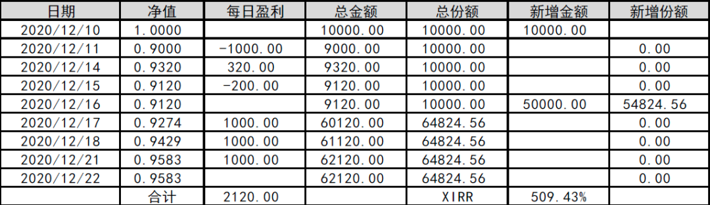

**
表 1 实际盈利时的净值表现
**

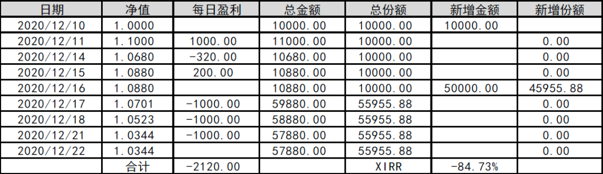

**
表 2 实际亏损时的净值表现
**

表 1 最终是盈利的，而净值即使在连续盈利情况下也难以抹平亏损；表 2 最终亏损，而净值却表现为盈利，即使连续亏损也屹立不倒。

这两种情况都有些违反常理，但有几个共同点：

1、没有资金流入时，净值能够完美体现盈亏情况；

2、有资金流入后，会导致净值在视觉上失真；

3、XIRR 函数的结果能够体现盈亏，但数值偏大。

针对前两点，将比较两种经典的业绩评价形式：时间加权收益率和金额加权收益率；最后一点将基于官方文档，从计算方法进行探究。

## 时间加权收益率

时间加权收益率中，所有时间段的资金都具备相同的权重，即「雨露均沾」。就计算方式而言，以发生资金进出为界，将各子区间收益率求几何平均。操作自己的组合时，通常都会收盘前调动资金，因此资金流应计入当日，此时表达式如下：

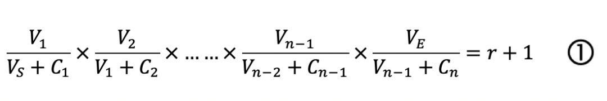

式中：Vs 为期初价值；Cn 为资金流入或流出额；Vn 为日终价值；Ve 为期终价值

以表 1 为例，代入相应数据：

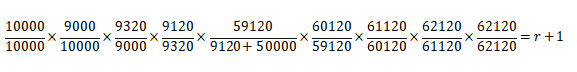

化简后：

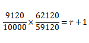

从而得出 r=-4.17%

净值收益率可视作基于时间加权收益率算法的改版，将资金进出额和当日盈亏折算为净值。仍以表 1 为例，由于净值在当日结算前是未知的，将当日资金进出额、份额及其产生的盈亏计入次日比较合理。将单位净值代入 ① 式：

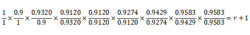

同样可以计算出 r=-4.17%，以此类推表 2 情况下 r=3.44%

## 金额加权收益率

内部收益率是采用金额加权计算收益率的典型应用。「非年化内部收益率」假设所有投资金额经过「天数累计」最终都能达到一个指定的收益率。其表达式如下：

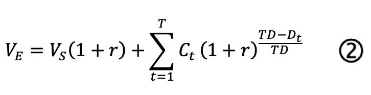

式中：Vs 为期初价值；Ct 为 t 日资金流入或流出额；Ve 为期终价值；TD 为整个计算周期总天数；Dt 为期初至 t 日的天数

表 1 为例，代入相应数据：

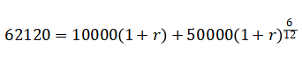

通过换元：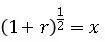，简化后得到：

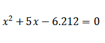

采用求根公式，可得两个根 x1=1.01725，x2=-6.01725。此处取正数根，进一步可求得 r=3.48%

> 注：为便于计算，将资金流入日设计在计算周期的中点位置，因此指数恰好能够取 0.5，可直接用求根公式得解。实际情况下，资金出入次数和时间是不确定的，计算时会出现非线性方程，一般采用迭代法求解，相关内容将在接下来的文章记录。

以上着重强调了「非年化」。相比而言，「年化内部收益率」更适宜计算较长的周期。其表达式如下：

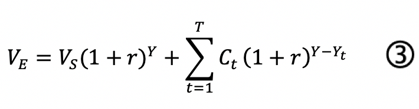

式中：Vs 为期初价值；Ct 为 t 日资金流入或流出额；Ve 为期终价值；Y 为以年为单位的整个计算周期；Yt 为期初至 t 日的年数

表 1 为例，代入相应数据：

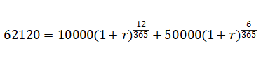

通过换元：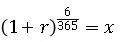，最终简化为

采用求根公式，可得两个根 x1=1.03015，x2=-6.03015。此处取正数根，进一步回推可求得 r=509.22%

## XIRR 探究

在 Excel 中，XIRR 与 IRR 两个函数的区别无须赘述。对于非定投组合，通常采用 XIRR 函数。然而，表 1 和表 2 的 XIRR 函数计算结果与根据 ② 式计算的结果有很大偏差。

文档关于 XIRR 函数的主要内容摘录如下：

_文档摘录_

_返回一组现金流的内部收益率，这些现金流不一定定期发生。_

_Excel 使用迭代技术计算 Xirr，直到结果准确到 0.000001%。如果 Xirr 在尝试 100 次后找不到可运行的结果，返回 #NUM！错误值。_

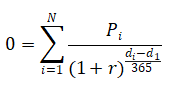

_其中_

_di = 第 i 个或最后一个付款日期。_

_d1 = 第 0 个付款日期。_

_Pi = 第 i 次或最后一次付款。_

根据文档给出的表达式，以表 1 为例，代入数据：

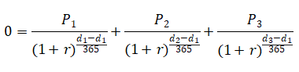

其中 d1=2020/12/10，d2=2020/12/16，d3=2020/12/22，按照实际使用函数的正负号规则代入金额：

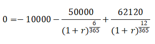

至此，等式两边同乘较大分母后，可转化为与代入 ③ 式完全一致的形式。

从结果也验证了 XIRR 函数计算得到的是「年化内部收益率」，与 ② 式按「天数累计」的计算思想有本质区别。两张表格中 XIRR 函数的计算结果相当于用 12 天时间的短期盈利去估算一年能拿到的收益，这显然并不恰当。

## 结论

自建非定投组合采用净值收益率衡量业绩时容易进入「视觉陷阱」：当存在资金进出时，净值并不能准确反映盈亏情况；使用内部收益率能够比较合理的反映计算周期内的盈亏，但应注意 Excel 原生 XIRR 函数的计算结果是「年化内部收益率」，若计算周期短，会出现不恰当的结果。
