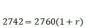

# 基于 Newton-Raphson 迭代法的日累计内部收益率算法实现

> [本文公众号地址](https://mp.weixin.qq.com/s?__biz=Mzg3OTczMDI3Mw==&mid=2247483764&idx=1&sn=d43c632590464c315df876fc263ddf6a&chksm=cf014a7af876c36cda5a9a204b0c6c75ded89b868b24f9942f227a070f3c62318eea58f7aca8&token=2063199681&lang=zh_CN#rd)

在上一篇文章 [净值陷阱](/2022-04-13-净值陷阱) 中探究了 Excel 的 XIRR 函数，虽然能够正确表征盈亏情况，但是其计算结果是年化内部收益率，若计算周期短，也会出现不恰当的结果。如果希望使用「日累计」内部收益率，则需要自行编写算法。基于最小引入原则，且该算法实现难度不大，本文将直接使用 VBA 编写计算「日累计」内部收益率的自定义函数。

首先回顾「日累计」内部收益率的计算表达式：

<center></center>

式中：Vs 为期初价值；Ct 为 t 日资金流入或流出额；Ve 为期终价值；TD 为整个计算周期总天数；Dt 为期初至 t 日的天数

为便于与原生 XIRR 函数区分对比，将自定义函数命名为 DIRR，同时截取了部分实盘数据作为计算模板案例，如表 1 所示：

<center></center>

**<center>表 1 计算模板案例</center>**

表 1 横向日期（B1、C1、D1……）所在列为当日数据，每列第四行表示「期初价值」，每列最后一行为「日终价值」。纵向日期（A4、A5、A6……）所在行记录了当日资金变动，为便于比较，数据符号按原生 XIRR 函数规则：期初价值取负，日终价值取正，资金转入取负，资金转出取正。

> 特别提示：在 WPS Excel 中使用 XIRR 函数时，上述算例少量单元格报#NUM!错误，而在 MS Excel 中显示正常，原因未知，已反馈到wps@wps.cn。自定义函数 DIRR 在两种环境均可正常可用。

## Newton-Raphson 迭代法求解

接下来从模板案例挑选几个时间点，分别为 2020/12/10、2020/12/11、2020/12/15，依次代入数据：

<center></center>

<center></center>

<center></center>

随着资金变动次数和天数增加，代入数据后所得表达式也越来越复杂，难以通过换元等常规计算方法求解。Newton-Raphson 迭代法解非线性方程的数学推导本文不做展开讨论，只针对上述需求介绍关键要点。

### ① 构建迭代表达式

迭代表达式的通用形式：

<center></center>

为便于累加计算，将时间权重独立出来，令，通过移项，可得到函数表达式：

<center></center>

对其求导可得：

<center></center>

### ② 编写主函数

新建模块，添加自定义函数。主要计算流程如下：

1、单元格调用 DIRR 函数时，依次传入「现金流数据集」和「日期数据集」；

2、通过 Transpose 将两种数据集分别转为资金流数组 mfArray 和日期数组 dateArray。

3、为便于累加计算，定义资金流变动数组 mfChangeArray 和时间权重数组 wtArray。将资金流数组 mfArray 去头尾（期初价值和期末价值）后，保存剩余数据到 mfChangeArray，计算相应时间权重存至 wtArray；

4、确定期初价值 vStart、期末价值 vEnd、迭代起点 stepStart、迭代要求精度 accuracy，开始计算；

5、每次迭代基于 r=stepStart 计算函数 f(r)值和导数 f'(r)值，以 f(r)/f'(r)作为步长，得出本次迭代的终值 stepEnd。若满足返回条件则返回，否则继续迭代。

返回条件 1：计算 stepEnd 和 stepStart 之差，当绝对值小于精度视作得解，返回 stepEnd 作为结果。

返回条件 2 ：迭代到第 100 次时，返回-100 作为错误值。

```vb
Option Explicit
' 当下标起始设为1时，UBound获取的上限值与数组长度相等
Option Base 1

Function DIRR(rangeMF As range, rangeDate As range) As Double
    ' 数组循环变量，临时变量
    Dim index As Integer
    Dim mfChangeArrayIndex As Integer: mfChangeArrayIndex = 1
    Dim doubleTemp As Double

    ' 资金流数组
    Dim mfArray()
    ' 日期数组
    Dim dateArray()
    ' 资金流变动数组
    Dim mfChangeArray()
    ' 资金流变动时间权重数组
    Dim wtArray()

    ' 提取调用函数的单元格数据
    mfArray = Application.WorksheetFunction.Transpose(rangeMF)
    dateArray = Application.WorksheetFunction.Transpose(rangeDate)

    ' 资金流变动数组长度
    Dim mfChangeLength As Integer: mfChangeLength = UBound(mfArray) - 2
    ' 防止当只有期初和期末数据时，数组长度定义为0报错
    ReDim mfChangeArray(IIf(mfChangeLength <= 0, 1, mfChangeLength))
    ReDim wtArray(IIf(mfChangeLength <= 0, 1, mfChangeLength))

    ' 计算周期总天数
    Dim TD As Integer: TD = dateArray(UBound(dateArray)) - dateArray(1)
    ' 资金变动时间点距离期初的天数
    Dim Dt As Integer

    ' 初始化mfChangeArray、wtArray
    For index = 2 To UBound(mfArray) - 1
        ' 当只有期初和期末两项数据时，不处理mfChangeArray、wtArray，即没有累加部分
        If mfChangeLength > 0 Then
            ' 为与原生XIRR函数比较结果，数据录入按XIRR函数规则：转入取负，转出取正
            ' 本算法资金流变动部分：转入取正，转出取负。在此做了符号转化
            mfChangeArray(mfChangeArrayIndex) = mfArray(index) * -1
            Dt = dateArray(index) - dateArray(1)
            wtArray(mfChangeArrayIndex) = 1 - Dt / TD
            mfChangeArrayIndex = mfChangeArrayIndex + 1
        End If
    Next

    ' 期初价值，与原生XIRR函数期初价值符号相反
    Dim vStart As Double: vStart = Abs(mfArray(1))
    ' 期末价值
    Dim vEnd As Double: vEnd = mfArray(UBound(mfArray))

    ' 迭代起止点
    Dim stepStart As Double: stepStart = -0.05
    Dim stepEnd As Double
    ' 迭代次数
    Dim count As Integer: count = 0
    ' 精度，与原生XIRR函数取相同
    Dim accuracy As Double: accuracy = 0.00000001
    ' 函数值
    Dim fx As Double
    ' 导数值
    Dim dfx As Double

    Do While True
        fx = accfx(stepStart, mfChangeLength, mfChangeArray, wtArray) + vStart * (1 + stepStart) - vEnd
        dfx = accdfx(stepStart, mfChangeLength, mfChangeArray, wtArray) + vStart
        stepEnd = stepStart - fx / dfx
        count = count + 1
        ' 精度符合要求
        If Abs(stepEnd - stepStart) < accuracy Then
            DIRR = stepEnd
            Exit Do
        End If
        ' 迭代超100次无论是否收敛都结束
        If count >= 100 Then
            DIRR = -100
            Exit Do
        End If
        ' 更新初值
        stepStart = stepEnd
    Loop
End Function
```

③ 编写子函数

在 DIRR 函数同一模块下添加两个子函数。主要作用是通过递归来处理函数和导数中的累加计算。

```vb
' 函数部分累加
Private Function accfx(r As Double, length As Integer, ByRef mfChangeArray(), ByRef wtArray()) As Double
    Dim result As Double
    If length = 0 Then
        accfx = 0
    Else
        result = mfChangeArray(length) * (1 + r) ^ wtArray(length) + accfx(r, length - 1, mfChangeArray, wtArray)
        accfx = result
    End If
End Function
```

```vb
'导数部分累加
Private Function accdfx(r As Double, length As Integer, ByRef mfChangeArray(), ByRef wtArray()) As Double
    Dim result As Double
    If length = 0 Then
        accdfx = 0
    Else
        result = wtArray(length) * mfChangeArray(length) * (1 + r) ^ (wtArray(length) - 1) + accdfx(r, length - 1, mfChangeArray, wtArray)
        accdfx = result
    End If
End Function
```

## 应用效果

取计算周期 2020/12/10-2022/4/15，实盘数据来自红利低波组合。可见随着时间迁移，统计日期的增加，XIRR 从最初的大幅波动逐渐与 DIRR 趋同。

<center></center>

## 参考文献

[1]同济大学应用数学系编.高等数学上册(第二版)[M].北京:高等教育出版社,2007 年

[2]基金从业资格考试命题研究中心编.证券投资基金基础知识[M].上海:复旦大学出版社,2007 年

[3]Carl Bacon 著，黄海东译.投资组合绩效测评实用方法(原书第二版)[M].北京:机械工业出版社,2015 年

[4]丁鹏著.量化投资策略与技术[M].北京:电子工业出版社,2016 年
