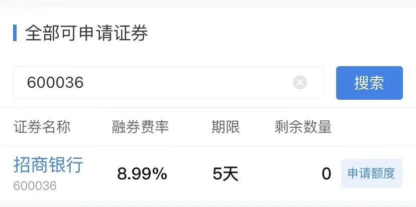
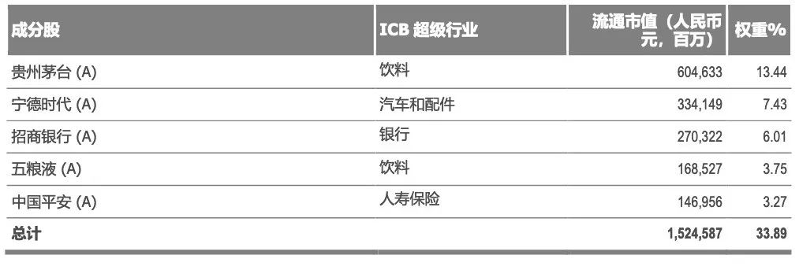
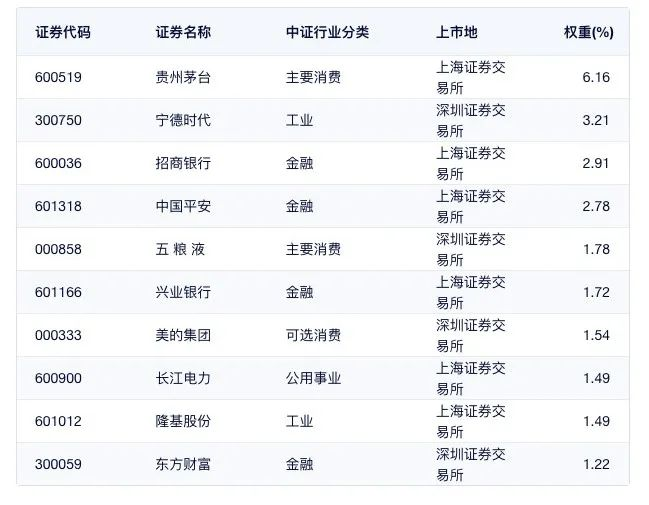
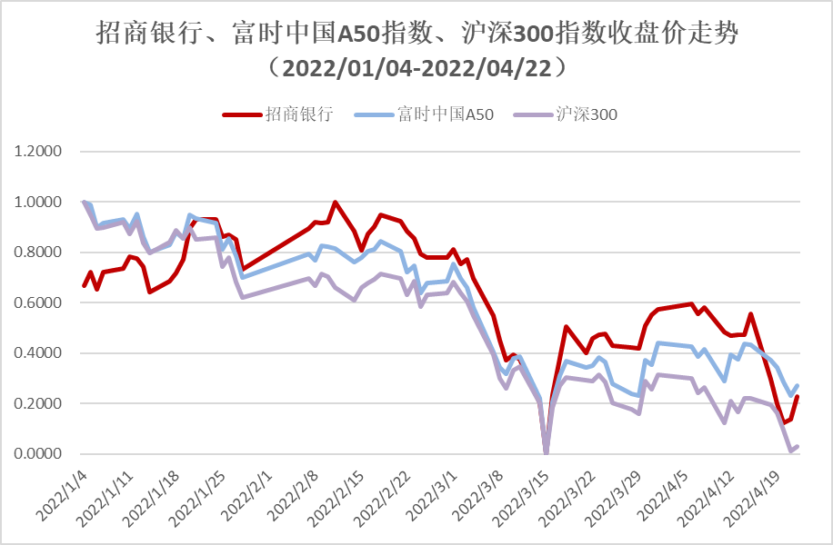
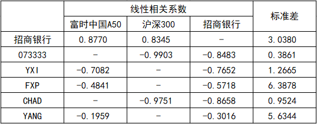
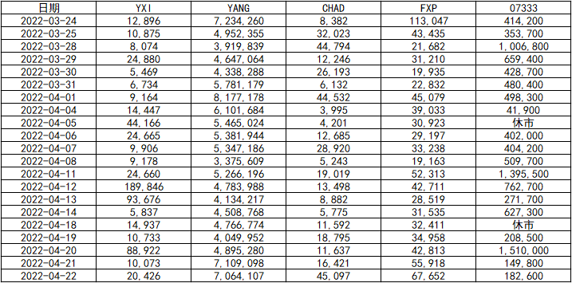

# 招商银行黑天鹅事件的风险对冲措施

> [本文公众号地址](https://mp.weixin.qq.com/s?__biz=Mzg3OTczMDI3Mw==&mid=2247483790&idx=1&sn=331913531c15ec36cde66509a58d1a51&chksm=cf014a80f876c39619714f184e69fe5c3e4a632a4bcfa99262d3ea2f67a2c3d4fec014664b23&token=2063199681&lang=zh_CN#rd)

4 月 22 日周五盘后，中央纪委国家监委官网宣布消息，正式坐实招商银行现任行长接受纪律审查和监察调查。同日晚间招商银行公布了 2022Q1 业绩，虽然季报增速平稳，但是与人事利空叠加发布的做法，耐人寻味，唯有坦然接受事实。仓位不高，但下周不确定性大幅增加，有必要适当防范。本文将从个人角度，尝试讨论对冲风险的措施，不做推荐，仅供参考。

本文讨论以下几种对冲风险措施：

1、融券

2、港股反向 ETF
（1）XI 南方沪深三百（07333）

3、美股反向 ETF

（1）ProShares Short FTSE China 50（YXI）

（2）ProShares Ultrashort FTSE China 50（FXP）

（3）Direxion Daily CSI 300 China A Shares Bear 1X Shares（CHAD）

（4）Direxion Daily FTSE China Bear 3x Shares（YANG）

## 融券

所在券商相关的融券费率、期限等参考信息如下图。但是招商银行不在共享券池，需要在交易日专门预约申请才能够融到。

## 反向 ETF

反向 ETF 主要涉及富时 A50、沪深 300。招商银行在该两只指数权重如下：

**
富时中国 A50 指数（FTSE China A50 Index）前五大成分股
**

**数据来源：FTSE Russell 中国区官网（https://www.ftserussell.cn）**

**
沪深 300（000300）前十大成分股
**

**数据来源：中证指数有限公司（https://www.csindex.com.cn）**

取 2022/01/04-2022/04/22 期间，招商银行、富时中国 A50、沪深 300 的收盘价做归一化处理后，三者走势如下：

**数据来源：东方财富 Choice 金融终端**

进一步计算线性相关性和标准偏差：

**数据来源：东方财富 Choice 金融终端**

从相关性结果来看，2022/01/04-2022/04/22 期间，招商银行价格变动对富时中国 A50 的影响更大。

上述反向 ETF 近一月的成交量：

**数据来源：东方财富 Choice 金融终端**

近一月平均成交量排序：YANG>07333>FXP>YXI>CHAD

## 优缺点浅析

1、融券

优点：可实施精准打击。

缺点：

（1）时效性：不佳，必须等周一交易时间才能申请，还不一定有券源。

（2）成本：难以评估此次利空规模和持续时间，融券成本不容易控制。

（3）流动性：难以评估此次利空规模和持续时间。由于时效性不佳，可能错过最佳卖点。

2、港股反向 ETF

优点：

（1）时效性佳，开盘时间与 A 股相同，可盘中根据实际情况操作。

（2）成本：不需要保证金，仅涉及佣金、平台使用费等常规费用。

（3）流动性较好，参考近一月的成交量。

缺点：做空标的为指数，覆盖面广，若其他权重带动指数反弹，存在轧空风险。

3、美股反向 ETF

优点：

（1）时效性较好，在 A 股开盘前就可潜伏。

（2）成本：不需要保证金，仅涉及佣金、平台使用费等常规费用。

（3）流动性参差不齐，参考近一月的成交量。

缺点：

（1）做空标的为指数，覆盖面广，若其他权重带动指数反弹，存在轧空风险。

（2）正所谓成也萧何，败也萧何，由于时区延迟，撤退时机不容易把握。

## 参考文献

[1]威廉·M.门登霍尔(William M.Mendenhall)著,关静等译.统计学(原书第 6 版)[M].北京:机械工业出版社,2018 年
