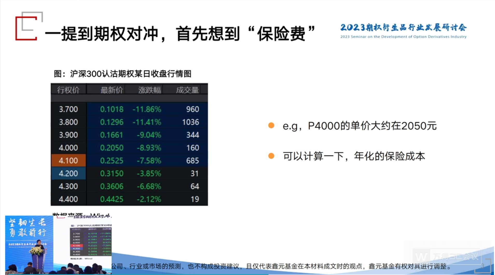
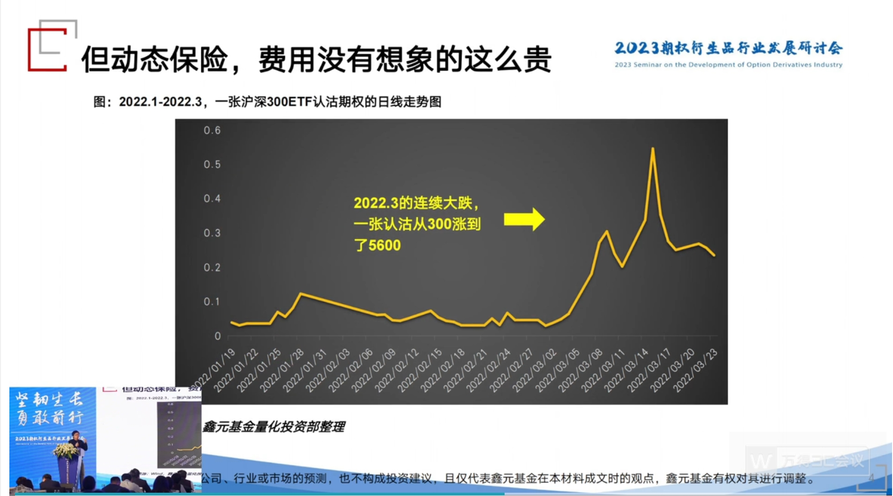
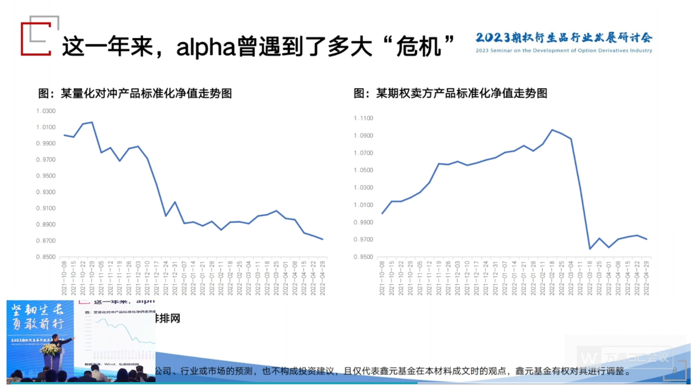

# 余力-被忽视的角落，期现对冲的实践体会-文字版

> [本文公众号地址](https://mp.weixin.qq.com/s/ety9Xyn8CgFtiezdPI9Obw)

各位期权圈的同仁们，大家下午好，我是鑫元基金的余力，我现在负责鑫元基金的量化投资。今天给大家带来的主题叫《被忽视的角落，期现对冲的实践体会》。我自己是从 2016 年初的时候离开上交所，然后在公募私募都转了一圈。

期间做了各种对期权策略的尝试。一开始的时候，我发的专户基本上都是集中在纯期权，也就是做波动率交易，或者做一些套利交易的。但是做着做着呢，我自己的体会，这个是实实在在的话，就是我们做资管干什么呢？是为了赚钱对吧，为了赚钱的话，那么我花了这么大的精力，这么辛苦的每天去这做这个风控和盯盘，最后的结果是产品的规模始终在三千万、五千万，我越来越觉得这个性价比下降了。那么，到了 2019 年的时候，随着自己实盘的经验的提升，我开始从事一个新的模式，就是期现结合。这个模式，我最早是在上一家公司，就是混沌的时候去做的一个尝试。

刚才招商基金的王岩总说的 Covered Call 也是一种期现结合，只不过它是一种相对简单的期现结合。由于我管理的是专户产品，更讲究绝对收益，更讲究控制回撤，所以我会在 Covered Call 基础上一定会加个 long put，加一个 lp。所以最早呢，是在 2019 年开始实践，那么实践到现在也有四年多时间了，所以我觉得在这个实践过程当中加了很多很多的这个体系上的优化，所以我觉得也特别值得和大家分享一下。

我现在在鑫元基金的量化投资分两条主线，第一个呢是专户，专户做的就是期现，把期权结合进去，控制回撤类的专户。那么，还有一类公募产品就是传统的选股指增（指数增强），我们也非常期待有朝一日能够把期权揉到公募里边去，发一些有特色的公募。那么，说到今天的主题，期现对冲，我就先说一下，关于对冲的理解。

什么是对冲？其实对冲这个词，现在由于和公募的很多股票多头的人也接触的比较多了，我的感觉对冲这个词被用烂了。都说自己的产品有对冲，股债平衡也是一种对冲，那么对冲是什么呢？我自己的体会就是：对冲，它一定是两个资产或者两个工具的负相关度起码有 80%以上才有资格说这是对冲。所以比如说一半成长，一半价值，这叫对冲吗？或者说我买一点白酒，再买一点新能源，这叫对冲吗？这个其实不是对冲，它应该叫做平衡，而不是对冲。因为有可能你的两类资产是会被双杀的。同样的道理，股债平衡也不是一种对冲，它只是一种平衡，因为两个东西被双杀的概率还是很大的。所以在我的自己的这个定义里边，对冲就是股票多头，然后去加上期指的空头，这个是对冲；然后我股票的多头加上我的买沽，我的认沽期权，这个是对冲。所以在我们的实践当中呢，我自己觉得如果你这个产品，这个专户里边不含衍生品的话，基本上就不能称之为是一个对冲。对冲既然要用衍生品，那么问题就来了。衍生品有没有成本？期指和期权分别的成本在哪里？

我们先来说说期指的成本。我们知道股指期货，我们的很多量化中性的这个产品，它的这个成本在哪里呢？它在于贴水。做期指空头的人是不喜欢贴水的，像刚才我们说 Covered Call 里边，我把期指多头去替代 ETF 是希望有贴水的，但是如果我做量化中性，我用期指空头去对冲，我是不希望有贴水的，贴水是我的成本。那么，这个成本以前高的时候呢，比如说 IC，都是两位数的成本，年化都是两位数的贴水。如果做 IF 呢，年化也有四到五个点的贴水。

最近的一年呢，贴水率是明显收窄了。也就是期指对冲的成本，大概做 IF 的话，可以缩小到三个点以内，做 IC 都可以在八个点以内。那我这么低的成本，是不是对我量化中性就是个好处呢？其实也不是的，刚才到会场的时候呢，在后台跟几位朋友聊的时候呢，正好也聊到一个概念，就是说期指的贴水越来越收窄啊，贴水越来越少，对期指空头和对冲是不是一件好事？那我的观点呢，它看似是一件好事，但是它同步反映了一件事情，什么事情呢？就是你股票组合的超额收益越来越难做。也就是 alpha 越来越难做，实际上我们做过一个很有意思的回测，我们把一些头部私募能够拿到的数据。把他们的 alpha 的平均水平做一个时间序列，然后呢，再把这个 IF、IC 的年化贴水率做一个时间序列。我们会发现，它的同步性是非常高的，也就是说，你可以这么理解：期指的贴水率，基本上就反映了咱们头部私募或者是全市场获得 alpha 能力的一个平均水平，所以当这个贴水率在急速收窄的时候。你去看一些私募产品，它的 alpha 也没那么大了，所以它是一件同步的事情，所以期指贴水收窄，并不意味着对量化中性一定是件好事，它是一个实实在在的成本。所以期指贴水的成本就是我们说的期指对冲的成本。那么，期指的对冲的成本就是贴水，那么，期权的对冲的成本在哪里呢？就在于我们说的买认沽的保险费，也就是买认沽的期权费。

买认沽的期权费也是让很多人望而生畏啊，也就是说不愿意去做期权对冲的一个很核心的原因，比如说以前啊，也接触过几家私募啊，一直做量化中性的。他们自己的诉求是 alpha 越来越难做，我期指对冲的每年的贴水率，我很难超越，搞了半天一年忙下来，净值一直在一点零 2 零 3 附近波动。这个大家也是可能会看到类似的产品，那么他的诉求是什么呢？他的诉求是我能不能保留一些 beta，就是我不想削平 beta，因为他觉得长期的 beta 削平太可惜了，但是他只会期指对冲。那么，他听到比如说期权，可以保留 beta，所以呢，他也会来关心这件事情，但是一看到咱们的 T 形报价。他首先看到的就是成本。所以期权费会让很多的人望而生畏，觉得做期权对冲一年的期权费那么多，所以放弃了这条路，就不做期权对冲。

图 1-沪深 300 认沽期权某日收盘行情图

那么大多数人是怎么算期权的这个保险费的呢？他是怎么算这件事情的呢？我们就来看一个数据啊，这是截了个屏，比如说咱们沪深 300 ETF 期权，这是认沽期权，我随便截了个屏。我们知道，现在沪深 300 在 4100 点左右，对吧？4100 点左右，那么它虚值一档的期权就是 4000 的认沽期权，虚值一档。那么这个期权现在是一个远月期权，大家看到的是一个 2000 块钱的成本，2050 块钱，它的年化的保险费有多高呢啊？很多朋友可能不会算，我们来算一算。沪深 300 的点位是 4100 点，我们沪深 300 ETF 是多少呢？是 4.1，它的合约乘数是一万，所以你的一张期权对应的面值啊是 41000 块钱，四万块钱左右。那么，现在这张期权的保险费是 2000 块。差不多是占了百分之多少呢？占了 5%左右，但这是一个远月期权，距离到期日差不多应该是七个月，现在是二月份，离九月份还有七个月。那么你再年化一下，也就是你去除以 7，再乘以 12 呢，你算下来的成本啊，大概在 7%到 8%左右。这个还是发生在现在隐波比较低的时候。

所以你这么一算，等于就是说我现在买沪深 300 ETF。或者我们我买四万市值的股票，这个股票比如说是这个沪深 300 里的龙头股啊，比如说宁德时代。我要花的成本是多少呢？我要花的成本是这个 4000 的虚一档，是个虚值期权，还是隐波这么低的期权。那么我算下来的年化成本都要 7%到 8%。然后这样一想的话，再比比那个期指的贴水率，然后啊，很多的私募的这个客户就觉得期权对冲我不做了，保险费太贵了啊，我不适合啊。但问题是，你的年化保险费就是 7%到 8%吗？其实这里有一个问题，什么问题呢？就是你现在买了一个今年九月份到期的。4000 的认沽期权。你实盘里会在场内期权里边，你真的会这么买吗？在从我 2019 年到现在的实践是，我的回答是：我不会的。我一定不会这么做的。接下来我就谈谈我的实践体会。

如果我们是一个场外期权的思维，比如说我们很多的私募会做一些场外的雪球，或者是牛差的结构。当然，他也会问场外的看跌期权有多贵，报价怎么报，听下来也不便宜对吧？如果你是一个场外期权的思维。你很有可能是这么做的：就是你买了一个远期的认沽期权之后啊，我就不再动了，就是一个静态的思维，我不动了。如果你是这么想的，那么你的年化成本真的有可能就是年化 7%到 8%。但是你不动了，结果是什么？你买了一个场外期权，或者你买了一个咱们沪深 300 的场内期权 4000 的虚一档。你不动了。它的结果是，它只能在这六个月，七个月里边防住 4000 以下的下行风险，其他都是都是不能防的。

而事实上，我们在实践当中会发现，标的价格它不可能是木乃伊不动，它肯定是涨涨跌跌。如果现在沪深 300 指数从 4100 点在今年上半年涨到了 4400 点，甚至突破了去年六月份的 4500 点。你这张期权还不动的话，它会变成什么呢？它基本上已经接近只有几百块甚至几十块了。那么这个时候如果标的价格再掉下来，你这张期权还有当时二月份，现在这个时候的防守力吗？已经没有了，它有巨大的盲区，所以我们在实盘里做这个期现对冲，一定不会是一个场外的思维，一定不会是一个静态的思维：买了一个远月的虚拟档，然后就不动了，不再管了，一定不会这样的，而是怎么做呢？而是有一个，我这边介绍一个名词，是借用了我们固定收益的一个名词，叫久期管理，这个名词可能在期权对冲里边，大家都可能没有听到过，是我自己的一个体会，就是我们在平时做期权对冲的时候，会有一个久期管理。也就是近远月，不一定有远月的，很多时候都是用近月的。因为近月的赔率大，近月的 gamma 大。当我需要防一个灾难的时候，我这个时候更多会把久期拉到近月。所以我们的这个防守的头寸，比如说我的 long put 在我的手里，现在是二月，今天是 11 号，我有可能有一点二月的，也有可能有一点三月的，所以这是个久期管理。那么在实盘里，如果你把久期拉短了，也是也就是说你用近月期权去防守，去对冲，去防灾难的话，你会发现你的年化的保险成本根本不是 7%到 8%，就不是我们现在这张图里的这个静态的成本。而是多少呢？而是有可能赚钱。怎么会赚钱？我期权对冲，明明每个月花了买 put 的保险费，为什么会赚钱呢？那是因为某个月份。出现了巨大的赔率。我就拿去年举例子。

去年我们知道是市场一路下行的年份，应该说做股票多头的都是亏百分之二三十是不过分的。但是我们去年一个专户在期权的对冲下亏损没有超过 4%，而且期权我们知道它 delta 不是 100%，其实指数跌 30%的时候，你只亏 4%，我认为已经防的其实非常好了。那么，为什么去年我的保险费不是个问题呢？因为我们去年在我们的大格局进入秋天，冬天以后。我们就把久期缩短到近月了，也就是在这个时候，我是一个逐月去买保险的思维。大家注意听这个逐月的意义啊，逐月的意义就在于我每个月花的保险费不再是刚才那张远月的 2000 多块了，而是一个月可能只有 300 多块钱。那么我比如说这个月 300 多块钱归零了，但是我突然有一个月 300 多块钱变成了 5600 块钱，那你说我这个这个年的保险费还是问题吗？就不是问题了。那么，去年哪个月份出现过这么大的赔率呢？或者说 gamma 呢？是三月份。

图 2-2022.1-2022.3，一张沪深 300ETF 认沽期权的日线走势图

我们知道去年三月份，其实是对卖方很不利的月份，但是期现对冲是最有利的，那么这个月份，一张我们当时的 300 块期权曾经到过 5600 块钱。在这个过程当中，到 5600 的时候，我记得是 3 月 15 号，差不多也临近到期了，正好做一个移仓换月。所以呢，这个期权其实在去年等于我们的专户里 300 到 5600，基本上这个 15 倍是全部兑现的。那么，这个 300 到 5600，你想一想，只要一年 12 个月份，里边有一个月份，曾经有一个认沽是有这么大的赔率的话。那么，这一年，我的年化保险费它还是 7%到 8%吗？它不是了，它可能是赚的。所以我们去年在期权的保险费上是赚的。所以我们这个东西其实大家因为在座的都是期权圈的朋友，一讲大家都能共振到我的这个心里的感受啊，但是这件事情在我路演的时候是极其痛苦的。因为在路演的时候，不管哪个资方都会问你，你保险费要花多少？我跟他说去年我没花保险费。他就不理解了，他说你不是防住了吗？不是最大回撤 4%吗？那你怎么没有保险费呢？因为保险费有一个月的赔率超过了其他 11 个月，所有保险费归零。这就是我们说的把久期缩短的一个非常重要的原因。你试想一下，如果我的久期没有缩短。而是买了一个远月期权的话，在那个月会怎么样？在那个月你本身的成本是 2000 块，而在那个月那个 2000 块的期权也就涨到六千七千块钱。那你的赔率是极小的。所以这就是我们对月份近远月的控制，这个在我们期现对冲里边是非常有价值的一件事情。这个就是我想说的期权在动态的保险下，它的保险费没有你想象的这么贵。

于是我们就发现了，当你的期权不再是一个静态保险的思维，而是一个动态保险思维的情况下。它相比于期指中性对冲就有一定的价值了，因为期指的对冲，我们说的稍微就是不好听一点的话，其实是一种无脑的对冲。我一个下午就可以教会一个人做期指对冲，然后他明天就可以上班了，对吧？这个很简单，等面值算好，然后你把这个数量给他讲清楚，他就会对冲了。然后呢，你再把基差管理的事情跟他讲讲呢，他就对冲的很优秀了。但是它不可避免的一件事情，就是当市场出现有 beta 行情的时候，远的不说，我们就说今年一月份。期指对冲，你看一看收益率有几个超过 2%的，没有的，因为你一个月要做出 2%的 alpha 很难。对吧，所以你期指对冲在一月份就几乎不可能有 1.02 的这样一个净值，但是我们期权对冲在一月份就赚了 4%，这个就是很明显的不一样，所以当 beta 行情，尤其在今年，我们觉得整个国内经济是一个复苏的行情的情况下，beta 的保留是非常重要的，那么期指对冲，其实它的吸引力就在下降了，对吧？那么要替换期指对冲。那只有一条路，就是期权套保，那期权套保就又是回到了保险费的控制，那就是我们刚才说的一个动态保险的思维。它的月份一定是有一个取舍选择的。

那么说到这个保险费的控制呢？我在路演的时候啊，我其实今天说叫实践体会，我的这个演讲主题叫实践体会。都是源自于我路演跟别人交流的一个经验，就是我遇到太多人问我期权保险的问题了。所以我就把这些问题浓缩在今天的半个小时里面跟大家讲。有人问我，说你花了这么大的心思在动态保险，包括久期的缩短啊，包括上面加卖购啊，或者一些别的操作去降低这个保险费，目的就是要降低对冲成本，我说对的，那么他说，我有个办法。我也能保留 beta，也能降低对冲成本，我说什么。他说，我减少期指的空头张数，也就是我期指空头，本来要对冲 50 手的，我现在对冲 30 手，留了 40%的敞口，他说我这样做择时，我也能降低我的基差的，负基差的成本。我说，对，你要有这个能力，你为什么还要对冲呢？这是个伪命题，所以择时对冲是一个伪命题，如果你有能有能力要对冲的时候，我对冲，我不要对冲的时候，我不要对冲，那你直接平掉多头就完了，是不是这个概念？所以其实择时对冲这个对冲本身就是个伪命题，而我们做期权对冲，为什么我从来不把它称为叫择时对冲，因为期权对冲，当我等面值的买完认沽之后，我的面值永远是 100%。我的名义本金永远是 100%，大家想想是不是，不管它的 delta 是 20%还是 50 还是 80，但是它的名义本金永远是 100%。名义本金永远是 100%和我们期指择时对冲，只花 60%的面值去对冲有什么区别？区别在哪里？我只要举一个交易日，大家就明白了，2020 年 2 月 3 号，当时我人还在巴厘岛。当天是电话遥控在做对冲的，那一天，我们知道 A 股市场发生了什么，所有指数低开 8%，还记得吧，那天就是等于我们过节回来之后，大家对这个新冠恐慌到要把所有的权益资产都抛掉。千股跌停，沪深 300 低开 7%点几，然后创业板低开 9%点几，这一天。如果是期指择时对冲的，你正好留了 40%的 delta 敞口，你会怎么样？你就会发现那 40%的权益资产就是以跌停的速度在亏损。但是如果你是用期权对冲，等名义本金只花了 20%的 delta 的这个仓位呢，你发现。你居然把 8%的低开全部兜住了。这就是区别，这个区别就是大幅跳空时候的区别，所以你减少期指空头和你去用等面值的虚值期权去对冲，它在大幅跳空时候的区别是非常明显的，一个就是留了多少敞口，亏多少钱，而一个呢，会把这个跳空缺口迅速的定价进去。也就是我们经常所说的一张 100 块的期权会迅速的变成五百六百，这就是一个区别。除了这个区别以外，还有一个区别就是期权交易里边一个不可替代，唯一的一个维度，什么维度呢？隐含波动率，Vega 的维度。在大幅跳空的时候，往往会同步伴随着一个事情，什么事情呢？升波了，隐含波动率从 20 到 30 了。会出现这样的情况，对吧？比如说我们去年的 4 月 25 号，我们 2020 年的 2 月 3 号，对吧？还有 2019 年的 5 月 6 号，等等很多，那么在这种跳空情况下呢，你都会发现当天升波五个点以上，而这个东西在我的认沽期权上，它就变成溢价了，波动率溢价了，而这个东西又是对我对冲端是好的，因为我是权利仓，我是买认沽的。所以这个部分给我的溢价又能够增强我的对冲效果，把我当天的回撤可能可以抹平个千分之几。因为我们做衍生品的人都是很都是很计较的啊，都是希望能够多千一是千一，能够多千二是千二，所以这一天隐波上升了我的净值就可以少亏个千三千四。是非常重要的，但是如果你是减少期指空头的话呢，你发现波动率的维度是帮不到你任何东西的。所以，减少期指空头和我用买认沽去对冲，它是完全不一样的，就算你的初始 delta 是一样的。但是你只要标地走下去，它就是不一样的，所以期权是个动态的事情，而且期权的认沽还有个好处就是：你一开始买的期权是百分之三十四十的 delta，随着标的下跌，它的 delta 会越来越大啊，经过平值的时候正好到 50%。然后呢，变成实值，以后变成七十八十，一步步越来越大，所以只要跌，你是不怕的。但是，减少期指空头的手数呢，你再往下跌，你是怕的，因为你毕竟有那么三四十的多头敞口，是没有保护的，这就是区别。

那么对于保险费的控制呢？我刚才提到了一个月份的管理，这个这个久期管理的事情，那么除了这个以外，光靠 long put 的，光靠买沽够不够呢？我认为是不够的，就是你的 long put 的久期管理再精妙，保险费还是有办法去继续抵消的，也就是说能够让净值做得更好看，什么办法呢？就是加上上面的 short call，加上上面的这个卖购。我们知道 Callar，这个策略标准的教科书式叫法是 Callar 领口策略，它是等于买标的，加上买认沽，再加上卖认购，是这么一个三腿的组合，我们叫 Callar。那么这个 Callar 如果无脑的做，把它变成是一个策略指数去做，它就是一个本本主义的多头，加一个领圈，也就是加一个买沽，再加一个卖购，然后到了下个月呢，你再移仓到下一个买沽加卖购，滚动的不断的做，然后就形成了一根曲线。但是真的在我们专户里去做，因为专户很灵活嘛，真的在公募专户里去做这个期现对冲的话，我们上面的这个 short call 不是永远存在的，不是一个必有的东西，而是一个或有的东西，所以在这个 Callar 里边，我会加一个字叫 dynamic，就是动态的 Callar，也就是这个 Callar 里边 long put 是始终有的叫必有，而 short call 呢，它不是始终有的，所以叫或有。为什么 short call 在我们的专户里边要或有，而不是永远要有？为什么呢？

我们知道 A 股市场的特点。它跟美股一个很不一样的地方就在于：美股的 short call 的帽子，我们把 short call，如果姑且称为叫帽子的话，它这个帽子是可以长期存在的。因为美股很少有一个月涨 7%。就是它是慢慢涨的，比如说你卖一个虚二档虚三档的期权，你跟它耗下去，你往往是能够归零的。因为它一个月也就涨三个点、四个点，全年标普 500 也就涨 12 个点，摊到每个月也就一个点，所以你卖一个 3%虚值的期权，你基本上是可以归零的。所以你的帽子可以始终存在，这是美股。但是在 A 股市场上呢，大家会感觉到一个特点，就是羊群效应还是非常明显的，也就是当你市场真的趋势来的时候，谁都怕踏空，当你觉得好像今天券商股拉了上影线不行了，明天还有资金会冲进去，指数会一涨再涨，涨到逼到喉咙口为止。我们有的时候做纯卖方的朋友都知道，当这个卖购或者卖沽接近平值的时候就好像有一把枪逼在自己的喉咙口一样，对吧？就这种感觉，然后到底你是被穿了还是没穿，自己也不知道，然后很慌。那么做对冲也是一样的，当你上方的这个期现结合里的这个 Callar 里的 short call 逼到喉咙口的时候呢，虽然你总体还是赚钱的，但是确实明显比持有现货要赚的少很多了。所以我们在交易体系里边还会加入一个风控机制，进行期现对冲的时候，有的时候是没有 short call 的。比如说今年的 1 月 6 号一直到今年的 2 月 1 号，这段时间我们的 short call 是大量的减仓的，也就这段时间内的 short call 在我的对冲头寸里没有了，我仅仅靠 long put 去防守，而不再通过 short call 去做成本的抵消了。但是在有些月份里边，我的 short call 是有的，而且它是一定要有的，它的数量跟 long put 是一样的，这就是一个动态机制。所以我其实把这个 option hedging，哪怕是这个 Callar，也把它称为是一个技术活，就像开车一样，我们开车的时候觉得好像我考了驾照，很简单，往前就行了，转转弯，但实际上到了路上呢，你发现开车还是很复杂的，尤其刚刚刚学会的时候，因为你到了路上之后，你发现有人闯红灯，你要让他一下，有人加塞了，你也要让他一下，有的时候呢，警察要你停下来了，又要让他一下。所以在实践当中会发现 option hedging 是一门技术活，尽管我自己是做量化投资的，但是我自己是认为在 option hedging 上面，它是有艺术的成分的，那么这个在我们的交易体系当中呢，我们会考虑很多东西。比如说，会考虑 long put 的月份选择，就是我们刚才说的久期管理，会考虑这个 short call 加在哪一个档位比较合适，会考虑 short call 的数量，以及 short coll 有没有，还会考虑我这个 long put 的和 short call 它的张数配比大概是几比几等等一系列问题，所以我把它称为是一门技术活。

说了这么多啊，我们从 2019 年开始到现在从事期现结合，主要是期权对冲，初心是什么呢？我的初心是不想失去 A 股市场的 beta，而且我自己呢，也越来越觉得 alpha 越来越难做，这是一个不争的事实。我们 2020 年和 2021 年两个年份是 A 股机构化进程最疯狂的两个年份，2020 年是公募发展很快的一年，而 2021 年是私募规模上升很快的一年，我们 2020 年 7 到 9 月份的时候会听到好多家百亿私募。会听到很多量化指增甚至中性产品规模动辙突破十个亿了。在这样的一个量化私募内卷的时代，你觉得未来的 alpha 是会好做还是难做呢？我觉得是比较难做的。事实上，很多的私募曲线也证明了 alpha 是难做的，比如说左边一个图，是一个量化中性产品，而右边这张图呢，是一张做期权卖方的产品。

图 3-某量化对冲产品标准化净值走势、某期权卖方产品标准化净值走势

也就是说，很多人觉得 alpha 通过选股来获得超额收益，右边是通过 theta 通过赚时间价值来获得超额收益，这两条路都是越来越难的。这是我在这个 2019 年的一个基本的认识。那么，有了这个认识之后呢，我就自己就觉得，如果我只通过 alpha 跟人家去竞争的话呢，其实这个内卷是非常非常辛苦的，而且有可能拼不过，所以我一定要保留 A 股的 beta。既然你心里要保留 beta 的话，又是一个做期权的人，这个出身那么自然就会想到期权对冲这件事情，所以也是为什么四年以来，我还没有觉得这条路是走错的，而且这条路还值得坚持走下去的一个很大的原因。

那么最后呢，我们也看到了，现在这个整个期权市场的一个发展情况，也就是从 2019 年 12 月 23 号期权三兄弟，我们叫沪深 300 期权三兄弟（上交所 300ETF 期权、深交所 300ETF 期权、沪深 300 指数期权）推出以后，三年没有过新的金融期权了，但是在去年啊，尤其在去年四月份，期货与衍生品法颁布以后，我们会发现各大交易所明显提速了，从去年七月份的中证 1000 期权（20220722 中证 1000 股指期货、中证 1000 股指期权）到九月份的 500 期权（20220919 上交所 500ETF 期权、深交所 500ETF 期权）、创业板期权（20220919 创业板 ETF 期权），再到去年年底的深 100 期权（20221212 深交所深 100ETF 期权）。这一个个期权推出来，对我们不管做波动率交易，还是期现对冲的人来说，肯定是多一条路的。那么，对于期现对冲的人来说呢，尤其是我们这个看到创业板和 1000 期权出来以后呢，我的第一反应是，我的动态领口体系又可以优化了，优化的点在哪里呢？就在于往下的 long put 和往上的 sell call 可以是不同品种了。比如说当你觉得，像今年二月份，大盘价值已经涨了这么好的情况下，1000 可能是相对强势的指数的话，那我上面的 short call 就不能再用中证 1000 去做卖购了。而是用上证 50 去做卖购了，所以我们现在的持仓结构是：下面是中证 1000 的 long put 的，上面是沪深 300 和上证 50 的 short call，等于又可以做这样的一个配对交易，所以越来越多的期权推出来呢，就不管对于我们做波动率交易还是做期现对冲的人来说啊，都是又多了一条路，我们的体系又有优化的点，又有值得去思考的点了，所以都是非常好的事情。今天分享了四年以来期现结合的一个对冲的实践体会，因为我觉得就是说实践出真知。我觉得这些话如果在四年前的衍生品论坛，我觉得我还是讲不出的。但是四年以后，我想把这四年当中的一些实践的点滴，给大家做一个分享，希望能够今天的分享对大家有所帮助。谢谢大家。
