# 股票指数构建方法探究

以上证50为例，通过复现指数有关指标并验证结果，探究股票指数的构建方法及计算细节，为构建自定义指数、降低自定义指数跟踪误差提供思路。

## 构建依据

上证50（000016.SH）由中证指数有限公司发布，构建过程依据其官网发布的相关文件：

（1）《中证指数有限公司股票指数计算规则》，以下简称「计算规则」

（2）《中证指数有限公司股票指数自由流通量规则》，以下简称「自由流通量规则」

<https://www.csindex.com.cn/#/about/governance>

由「计算规则」第2.1条可知价格指数采用派许加权方法进行计算：

其中，指数调整市值计算：

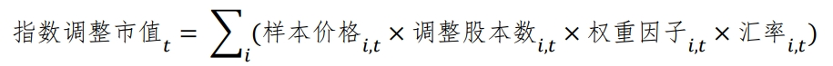

主要涉及5个主要参数：除数、样本价格、权重因子、汇率、调整股本数。

### 1 除数

「计算规则」第3条，除数定义：为保证指数的连续性，当指数样本、股本结构发生变化或样本的市值出现非交易因素的变动时，指数在变动生效日前一日收盘后采用除数修正法修正原除数。

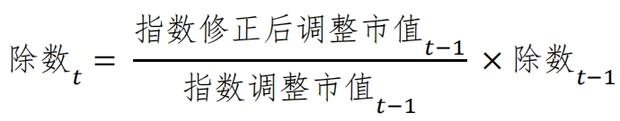

其中，指数修正后调整市值计算：

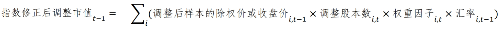

由此公式得出 t 日除数，并据此计算以后的指数。

#### 1.1 需要除数修正的情况

（1）样本公司发生可能影响证券价格变动的公司事件时

除息：凡有样本除息（分红派息），价格指数除数不予修正，任其自然回落。除权：凡有样本送股、配股、拆股或缩股时，在样本的除权日前一日收盘后修正指数除数，按照新的股本与价格计算样本调整市值。

（2）样本公司发生引起股本变动的其他公司事件时

当样本股本发生由其他公司事件（如增发、债转股、权证行权等）引起的总股本变动累计达到或超过 5% 时，对其进行临时调整，在样本的股本变动生效日前一交易日收盘后修正指数除数。

当样本股本发生由其他公司事件引起的总股本变动累计不及 5% 时，每半年定期调整一次，调整生效时间分别为每年 6 月和 12 月的第二个星期五的下一交易日，在股本定期调整生效日前一交易日收盘后修正指数除数。

（3）样本调整

当指数样本定期调整或临时调整生效时，在调整生效日前一交易日收盘后修正指数除数。

### 2 样本价格

经短期测试，取当日不复权收盘价或前复权收盘价结果区别不大。另外，除数修正对于除息是不处理的，因此目前更倾向于取不复权收盘价。

### 3 权重因子和汇率

在「计算规则」第2.1条有关权重因子和汇率的说明：

> 权重因子介于 0 和 1 之间，由权重与调整后自由流通市值的比值计算得出。若未特殊说明，则权重因子、汇率均为 1

这部分的权重因子或汇率会有坑，在反例中将会体现。

### 4 调整股本数

依据「自由流通量规则」第5条，计算调整股本数需要三个主要参数：总股本、自由流通量（F10信息中也称流通A股）、分级靠档加权比例。之间的关系如下：

自由流通比例 = 自由流通量 ÷ 证券总股本

调整股本数 = 证券总股本 × 分级靠档加权比例

自由流通比例为中间量，对照下表可得出分级靠档加权比例。

分级靠档加权比例对照表

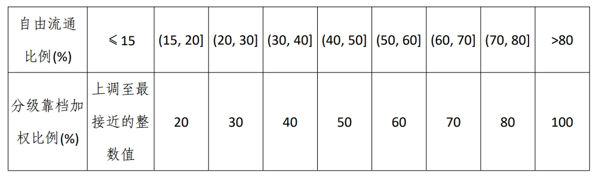

总股本和自由流通量可通过东财 Choice 金融终端的数据浏览器获取。

## 计算案例（反例）

时间点取20240701，将总股本、自由流通量、收盘价、权重因子、汇率集中到 Excel 中进行计算，假设权重因子=汇率=1：

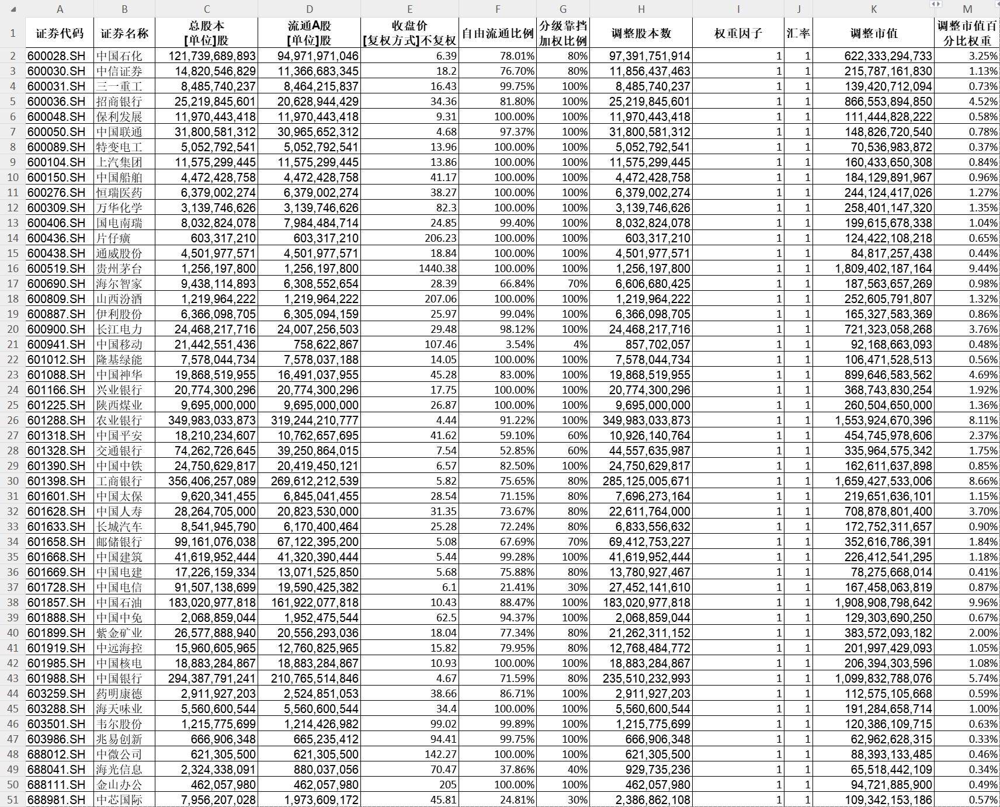

其中计算分级靠档加权比例，以首行单元格 G2 为例，采用 IF 嵌套实现：

> =IF(G2<=0.15,ROUNDUP(G2,2),IF(G2<=0.2,0.2,IF(G2<=0.3,0.3,IF(G2<=0.4,0.4,IF(G2<=0.5,0.5,IF(G2<=0.6,0.6,IF(G2<=0.7,0.7,IF(G2<=0.8,0.8,1))))))))

## 存在问题

观察计算结果，发现所得的关键数据与官网公布的均不一致；前十大权重也不一致，甚至熟悉的榜首大哥都已经易主。

全部成分股「调整市值」之和，即为「指数自由流通市值」；

相对误差 = ( 计算值 / 官方值 ) - 1；

20240701-20240705每日官网信息详见附录。

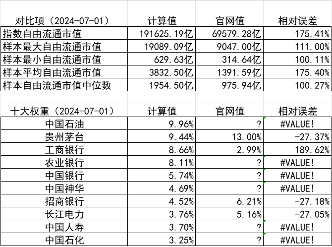

中证指数公司的指数详情页信息是每个交易日盘后更新的，包括十大权重股权重、统计数据。而全部成分股权重只能获取上月最后一个交易日的数据。下载0628的权重数据作比较，可见与计算值相距甚远，因此有理由怀疑假设条件（权重因子=1，汇率=1）有问题。

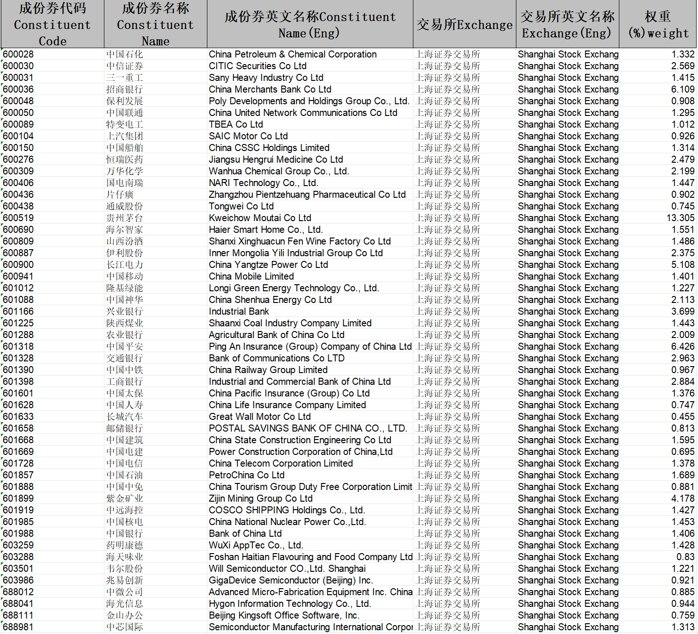

为验证这一情况，同时便于计算，接下来忽略汇率影响，令汇率值继续为1，只考虑权重因子，将其视作未知，用官网每日公布的统计数据反推。

## 计算案例及结果对比（正例）

总股本、自由流通量、收盘价、指数自由流通市值时间点取20240701，令汇率=1，权重时间点取0628，集中到 Excel 中再次进行计算：

推算调整市值n = 权重n × 指数自由流通市值

推算权重因子n = 推算调整市值n ÷ 收盘价n ÷ 调整股本数n ÷ 汇率n

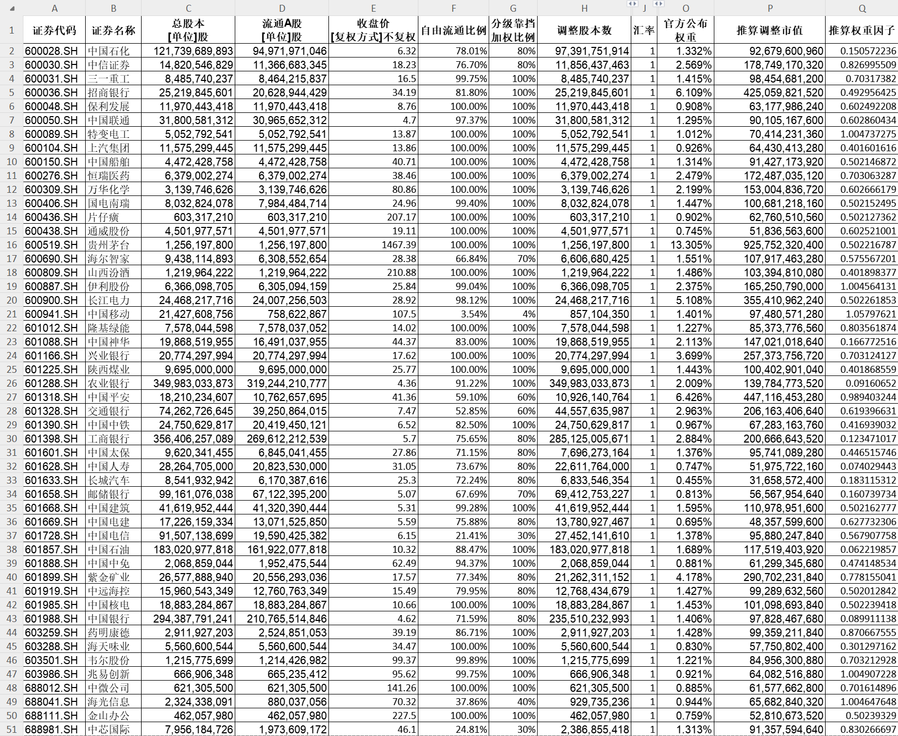

将推算权重因子代入20240701-20240705时间段进行验证。以20240701当日指数收盘点数2405.47作为基点，除数取当日计算值69581.37亿。同时引入四个参考值：流通市值、流通市值权重，根据当日官网公布的指数自由流通市值和0628的权重计算的当日推断调整市值、推断权重因子。

20240701计算结果

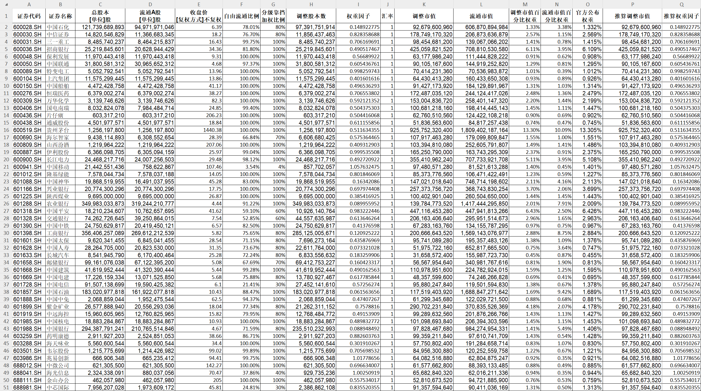

20240702计算结果

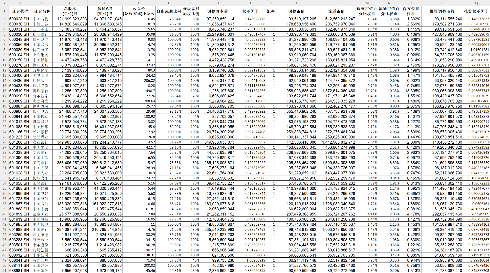

20240703计算结果

20240704计算结果

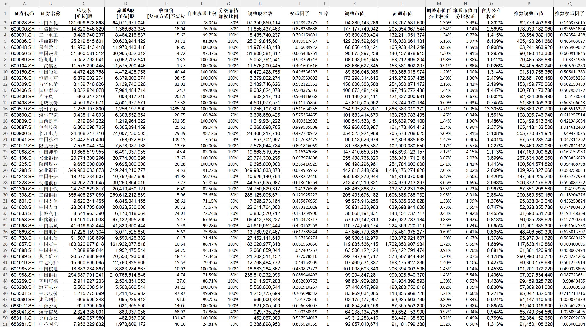

20240705计算结果

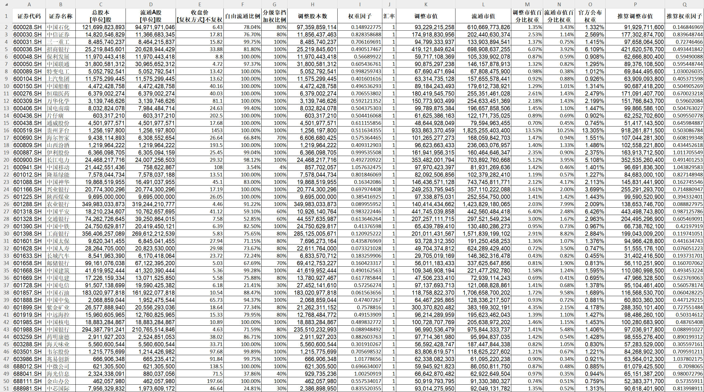

根据以上计算结果，与官网每日公布数据和真实指数点进行对比

20240701结果对比

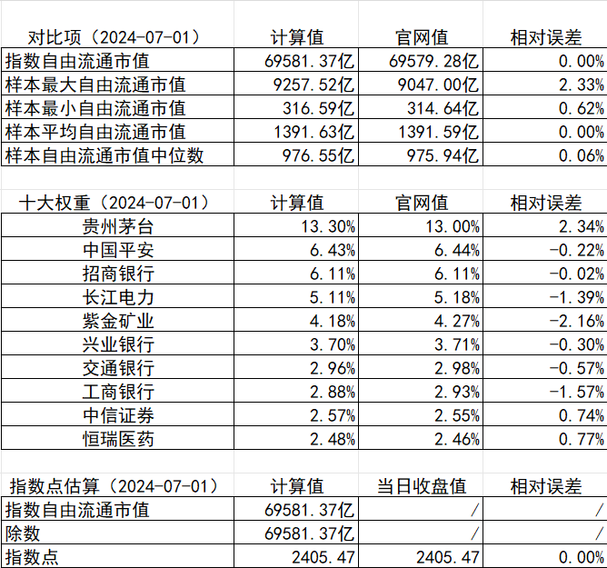

20240702结果对比

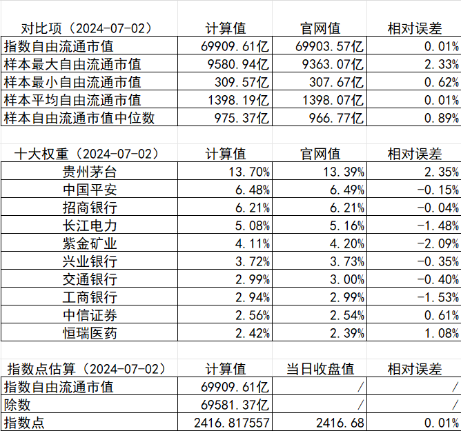

20240703结果对比

20240704结果对比

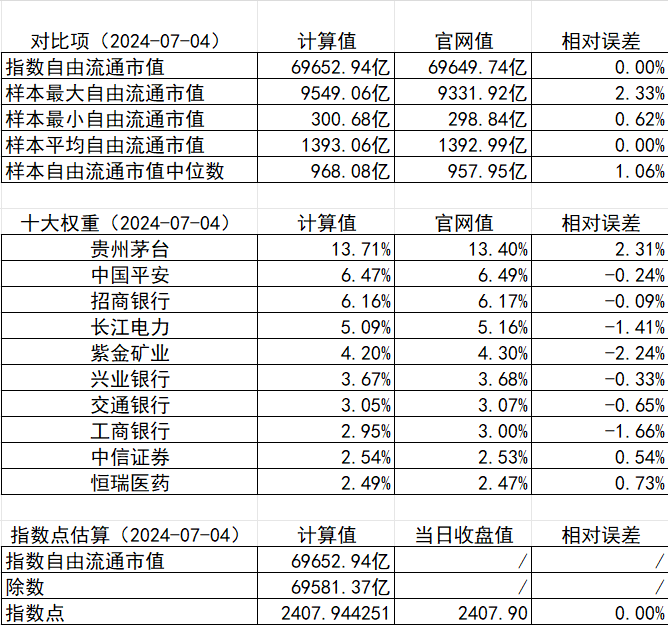

20240705结果对比

## 总结

通过上述计算和验证，本文采用的估算方法能够与官方给出的统计量、前十大权重以及实际指数点保证较小的相对误差，为构建自定义指数、降低自定义指数跟踪误差提供了思路。同时，也可以看出指数中的权重因子变量能够对成分股产生较大影响，即使在市值相当的情况下，可以通过权重因子有效调整其排名，对指数跟踪产品而言，是否会进一步对产品仓位产生影响，是否由此产生波及更广泛的蝴蝶效应也未可知。

## 附录

（1）本文使用的 Excel 算例等资源，如有需要可前往下载：<https://github.com/excellentfund/articles>

（2）中证指数公司在 0701-0705 公布的上证50指数详情页信息截图：

2024-07-01

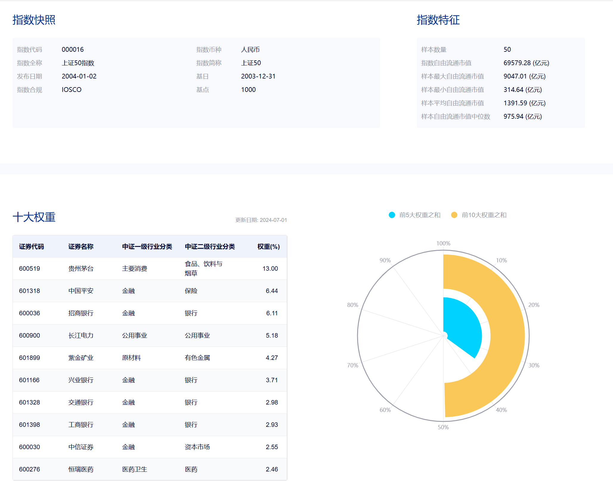

2024-07-02

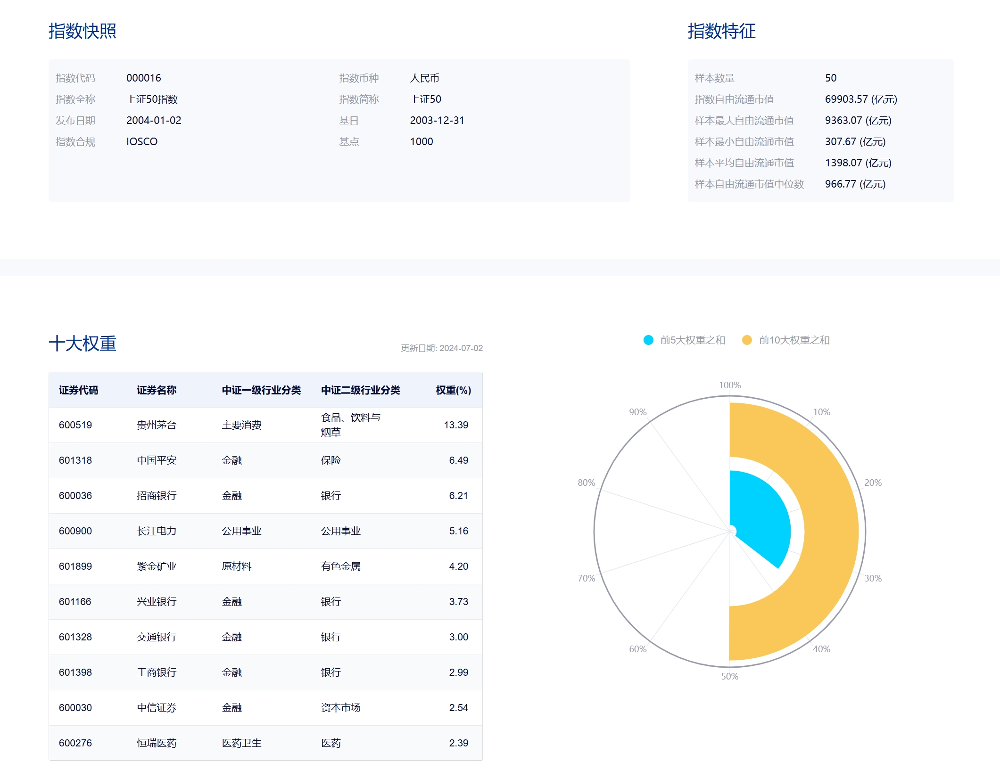

2024-07-03

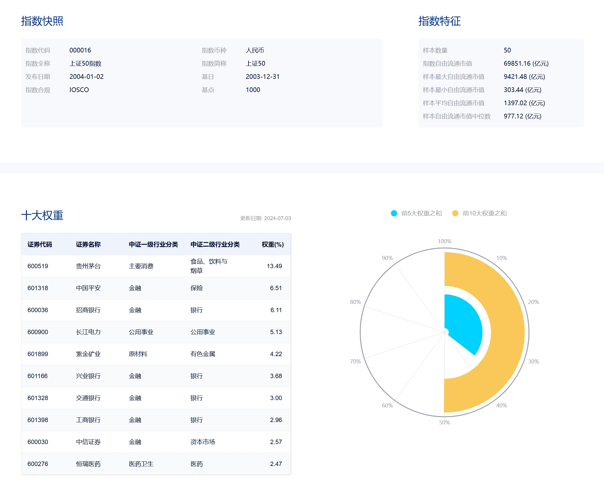

2024-07-04

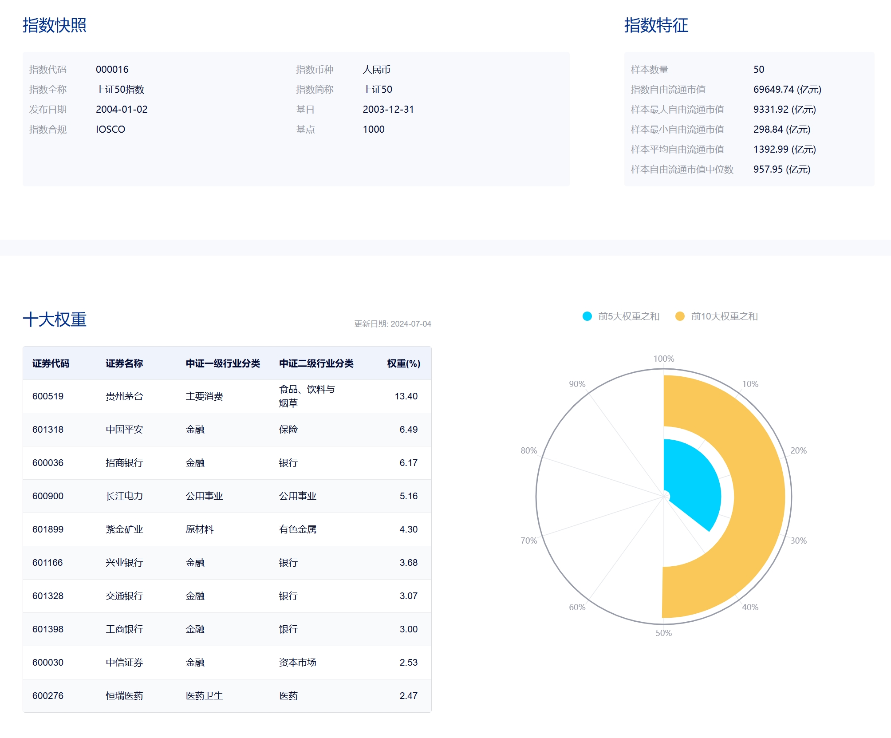

2024-07-05

