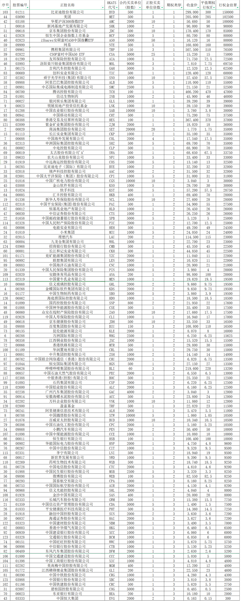
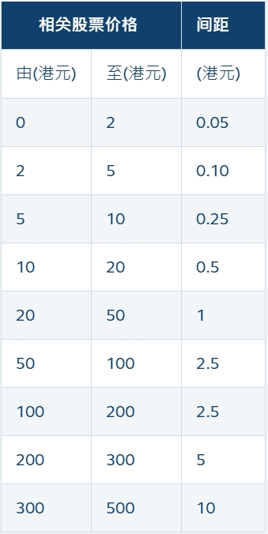

# 港交所股票期权行权金估算

港交所股票期权的交易规则与其他市场略有不同，尤其是合约单位并不统一，容易造成计算行权金和权利金时很不直观。本文给出算例，根据当日收盘价估算港交所一张股票期权的行权金，为资金安排提供参考。

## 交易规则

有关规则详见港交所官网：

https://sc.hkex.com.hk/TuniS/www.hkex.com.hk/Products/Listed-Derivatives/Single-Stock/Stock-Options?sc_lang=zh-HK

## 计算结果

根据港交所官网公开信息（生效日为 2024-02-23），目前可供交易的期权标的合计 126 个。将关键字段整合到 excel，按 2024-10-03 收盘价确定平值期权行权价，行权估算金额=合约买卖单位 × 平值期权行权价。计算后按估算金额降序排列如下表：

<center></center>

## 计算过程

### 1 收盘价

本案例收盘价数据从通达信获取，每个标的价格数据保存在对应 txt 文件。文件名格式如 31#01093.txt，数据格式如下：

```js
01093 石药集团 日线 不复权

日期  开盘  最高  最低  收盘  成交量  成交额
2024/10/02,6.040,6.540,6.030,6.430,1314816,836828352.00
2024/10/03,6.410,6.440,6.020,6.220,996461,618148480.00
数据来源:通达信
```

### 2 平值期权行权价

根据港交所官网计算规则（如下表）结合收盘价计算。范围取半开区间，如[0,2)和[2,5)，收盘价落在相应区间的按间距修约。如价格 50.68，按间距 2.5 修约，四舍五入取整：50.68/2.5≈20\*2.5=50，即 50 为平值期权行权价。

<center></center>

> 携程股价超过 500，而规则中未明确范围，根据股票软件期权链价格，间距取 10。

### 3 行权估算金额

行权估算金额=合约买卖单位 × 平值期权行权价

### 4 使用 python 整合数据

将港交所股票期权信息表（hkoptions.xlsx）与收盘价格数据文件放到同一目录，计算结果为四个字段：股票代码、日期、收盘价、平值期权行权价，输出到 output.xlsx 文件。处理代码如下：

```python
import fnmatch
import os
import pandas as pd
import re


# 定义修约间隔函数
def get_rounding_interval(value):
    if 0 <= value < 2:
        return 0.05
    elif 2 <= value < 5:
        return 0.1
    elif 5 <= value < 10:
        return 0.25
    elif 10 <= value < 20:
        return 0.5
    elif 20 <= value < 50:
        return 1
    elif 50 <= value < 200:
        return 2.5
    elif 200 <= value < 300:
        return 5
    elif 300 <= value < 500:
        return 10
    elif value >= 500:
        return 10
    else:
        raise ValueError(f"Value {value} is not valid.")


# 读取Excel文件中的B列数据
excel_file_path = r'C:\Users\workstation\Desktop\doctest\hkoptions.xlsx'
df = pd.read_excel(excel_file_path)

# 将B列数据转换为字符串，并在不足5位的前面补0
column_b_data = df.iloc[:, 1].astype(str).apply(lambda x: x.zfill(5))

# 初始化结果列表
results = []

# 遍历B列数据
for value in column_b_data:
    # 构建文件搜索路径，查找包含股票代码的文件
    search_dir = r'C:\Users\workstation\Desktop\doctest'
    file_pattern = f'*{value}*.txt'

    # 查找匹配的txt文件
    for filename in os.listdir(search_dir):
        if fnmatch.fnmatch(filename, file_pattern):
            file_path = os.path.join(search_dir, filename)

            # 读取txt文件内容。注：win环境下txt文件编码为ASNI（cp1252）
            with open(file_path, 'r', encoding='cp1252') as file:
                for line in file:
                    # 使用正则表达式匹配行内容
                    match = re.match(r'^(\d{4}/\d{2}/\d{2}),(.+),(.+),(.+),(.+),(.+),(.+)$', line.strip())
                    if match:
                        groups = match.groups()
                        date = groups[0]
                        if date == '2024/10/03':
                            close_data = groups[4]
                            close_data_float = float(close_data)
                            # 计算修约间隔
                            rounding_interval = get_rounding_interval(close_data_float)
                            # 四舍五入为整数，再乘以修约间隔
                            rounded_value = round(close_data_float / rounding_interval) * rounding_interval
                            # 添加结果
                            results.append([value, date, close_data, rounded_value])
                            # 不再找后续行
                            break
            # 如果找到符合的文件，不再找后续
            break

# 创建DataFrame并保存到新的Excel文件
output_df = pd.DataFrame(results, columns=['股票代码', '日期', '收盘', '平值期权行权价'])
output_df.to_excel(r'C:\Users\workstation\Desktop\doctest\output.xlsx', index=False)

print("处理完成，结果已保存到output.xlsx")
```

## 附录

本文使用的 Excel 算例及代码详见

https://github.com/excellentfund/articles
