# 增额寿险产品收益测算——阳光人寿臻爱倍致

增额寿险一般通过银行渠道购买，通常作为理财推介或某些业务的捆绑条件。本文以3年缴费期的阳光人寿臻爱倍致终身寿险为例，试算每个保单年度末现金价值的XIRR，并与货币基金相比较，观察在保险产品政策调整以及降息背景下的收益表现。

## 前言

**1 国家金融监督管理总局文件**

2024年8月2日，国家金融监督管理总局公布《关于健全人身保险产品定价机制的通知》，自2024年9月1日起，新备案的普通型保险产品预定利率上限为2.5%。

> 文件链接 https://www.cbirc.gov.cn/cn/view/pages/ItemDetail.html?docId=1175200&amp;itemId=928&amp;generaltype=0

**2 保险合同要素**

该产品有非强制锁定期，现金价值需要5年增值才能超过投保总费用（现金价值表详见附录1）。本文算例按照退保一次性取出情况下，计算现金价值的XIRR。

<center>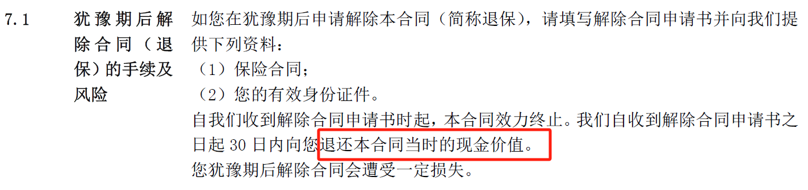</center>

> 特别注意：增额终身寿险的【保额】按3.33%增长不代表【现金价值】也按此增长。保额与赔付的金额有关，而退保时以现金价值为准。两个概念容易产生混淆，也是宣传推介时常用的误导手法。

## 计算过程

**1 引入现金价值数据**

现金价值表详见附录1。根据XIRR公式的参数要求，还需要把缴费金额和时间引入，但XIRR应用在单元格时有个缺陷：要求日期、金额都是连续的行。在本算例中现金价值是按年度末一次性取出的方式，因此计算时不能包含之前的现金价值。

<center>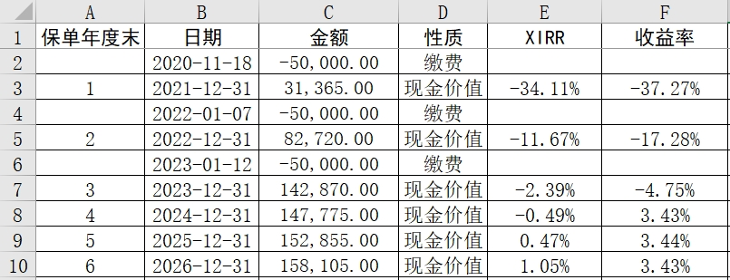</center>

以上表前4个年度末为例。时间、金额序列从第2年度末开始就不再连续（从左侧行号可看出），如下所示：

第1年度末：

<center>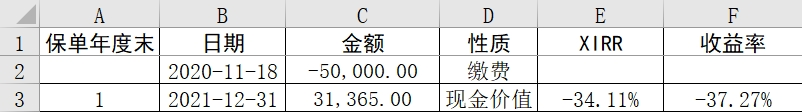</center>

第2年度末：

<center>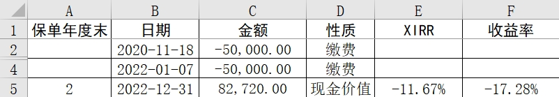</center>

第3年度末：

<center>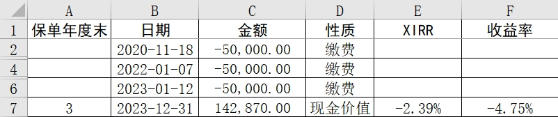</center>

第4年度末：

<center>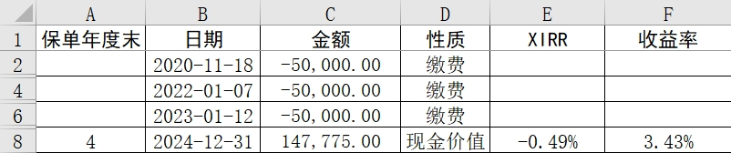</center>

为保证表格的连续性，同时避免XIRR在单元格应用时的缺点，计算改用VBA实现，将日期、金额分别组合为连续数组，再调用内置公式（VBA代码详见附录2）。

**2 引入货币基金数据**

从天天基金观察到近5年表现排名首、末两只货币基金分别是：交银天利宝货币E、先锋现金宝货币。

<center></center>

<center></center>

数据来源：天天基金网，截止日期2024-12-31

分别获取两只基金在2020/11/18~2024/12/31期间的万份收益。由于有三个年度投资金额有增加，因此将金额变化前后时间段隔开，最后按六个时间段计算万份收益的累计收益：

交银天利宝货币E-002890

<center>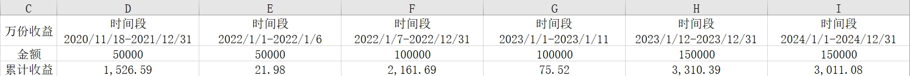</center>

先锋现金宝货币-003585

<center>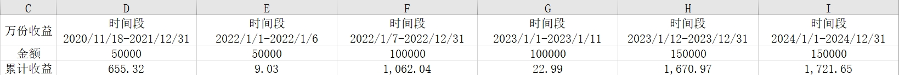</center>

**3 收益比较**

目前仅能获取2024年末及之前的基金数据，因此货币基金在2025年之后的业绩都以2024年全年万份收益的算术平均值参与计算。各年度末收益比较如下图所示：现金价值在第7年末实现对先锋现金宝货币的超越；在第10年末实现对交银天利宝货币E的超越。

<center>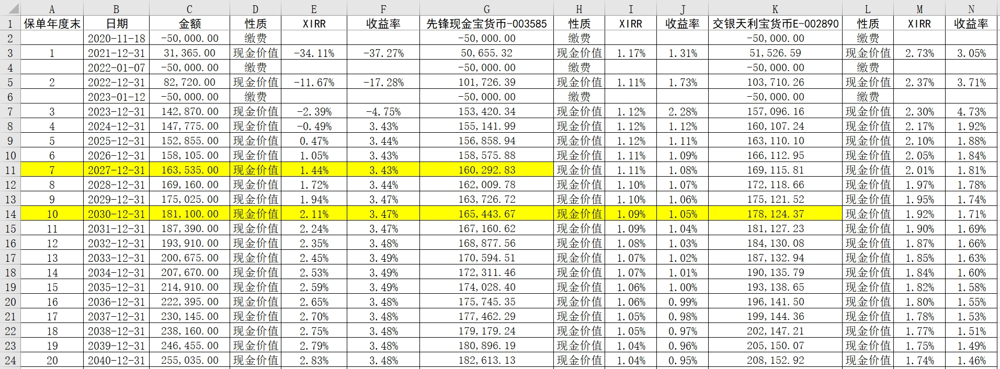</center>

## 总结

根据收益比较结果来看，3年缴费期的阳光人寿臻爱倍致终身寿险持有7-10年的现金价值可以与货币基金相当，而10年之后现金价值的增速将超越货币基金。

参与比较的货币基金自2025年起的收益都是假设值。在当前经济环境下，短期国债、同业存单等货币基金主要投资品种的收益率下降，进而也会影响货币基金的整体收益，按2024年计算的万份收益假设值是否能够保持犹未可知。因此，从配置角度而言，这类保险产品在目前具有一定意义，且具有5年回本期，属于相对稳健的强制储蓄品种。另外，在阳光保险官网查询得知，该款保险在2023年1季度至2024年3季度期间的退保率不高（详见附录3）。

XIRR大小与资金期限有关，早期投入的资金比后期投入的资金具有更高的现值，因此在增速相当情况下，缴费年限越短，此类产品优势可能更大。

本文仅探讨特定保险产品现金价值收益问题，而保险作为一种综合性金融工具，还具备解决继承权纠纷、隔代传承、避债、获取教育资源等附属增值功能，不应片面认同或否定，要根据不同配置需求综合考虑。

## 附录

**1 保险合同的现金价值表**

<center>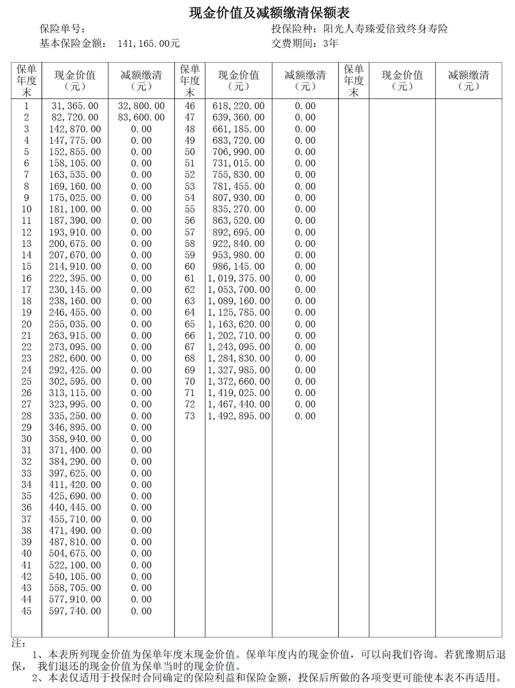</center>

**2 重新组合计算XIRR的完整VBA代码**

```vb
Sub CalculateXIRR()
    Dim ws As Worksheet
    Dim lastRow As Long
    Dim i As Long, itemIndex As Long
    Dim payDates As Collection
    Dim payValues As Collection
    Dim cashValueDate As Date
    Dim cashValueRow As Long
    Dim tempDates As Variant
    Dim tempValues As Variant
    Dim xirResult As Double

    Set ws = ActiveSheet

    ' 指定计算范围
    Dim dict As Object
    Set dict = CreateObject("Scripting.Dictionary")

    ' 数组下标对应：日期【0】、金额【1】、性质【2】、XIRR【3】
    dict.Add "臻爱倍至", Array("B", "C", "D", "E")
    dict.Add "先锋现金宝货币-003585", Array("B", "G", "H", "I")
    dict.Add "交银天利宝货币E-002890", Array("B", "K", "L", "M")

    For Each Key In dict.Keys
        dicItem = dict(Key)
        ' 金额为空时停止计算
        lastRow = ws.Cells(ws.Rows.Count, dicItem(1)).End(xlUp).Row

        ' 初始化集合
        Set payDates = New Collection
        Set payValues = New Collection

        ' 遍历每一行
        For curRow = 2 To lastRow
            ' 检查是否为空
            If ws.Cells(curRow, dicItem(1)).value = "" Then Exit For

            ' 检查是否为【缴费】
            If ws.Cells(curRow, dicItem(2)).value = "缴费" Then
                ' 保存缴费日期、金额
                payDates.Add ws.Cells(curRow, dicItem(0)).value
                payValues.Add ws.Cells(curRow, dicItem(1)).value
            ElseIf ws.Cells(curRow, dicItem(2)).value = "现金价值" Then
                ' 有缴费数据则计算XIRR
                If payDates.Count > 0 Then
                    ' 将集合转换为数组（+1是预留添加最新的现金价值数据）
                    ReDim tempDates(1 To payDates.Count + 1)
                    ReDim tempValues(1 To payValues.Count + 1)

                    For itemIndex = 1 To payDates.Count + 1
                        ' 最后一个元素放现金价值数据
                        If itemIndex = payDates.Count + 1 Then
                            tempDates(itemIndex) = ws.Cells(curRow, dicItem(0)).value
                            tempValues(itemIndex) = ws.Cells(curRow, dicItem(1)).value
                            Exit For
                        End If
                        tempDates(itemIndex) = payDates(itemIndex)
                        tempValues(itemIndex) = payValues(itemIndex)
                    Next itemIndex

                    ' 计算XIRR
                    xirResult = Application.WorksheetFunction.Xirr(tempValues, tempDates)

                    ' 填入结果
                    ws.Cells(curRow, dicItem(3)).value = xirResult

                End If
            End If
        Next curRow
    Next Key
End Sub
```

> 注意：使用WPS Office 17150版本的WPS Excel执行该代码时存在问题，计算XIRR至2072-12-31会停止，后续日期无法计算，改用MS Office Excel没有此问题。

**3 季度偿付能力报告摘要（2023-2024年）**

> 阳光人寿保险季度偿付能力报告摘要 https://www.sinosig.com/v/pilu?type=sx&tabIndex=10001_39


2024年第3季度偿付能力报告摘要-退保金额前三

<center>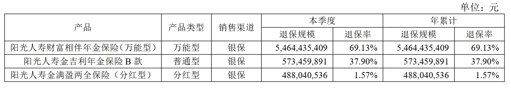</center>

2024年第2季度偿付能力报告摘要-退保金额前三

<center>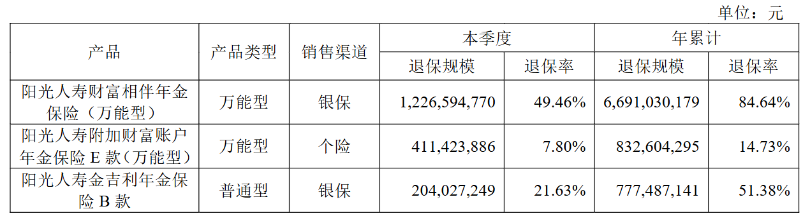</center>

2024年第1季度偿付能力报告摘要-退保金额前三

<center>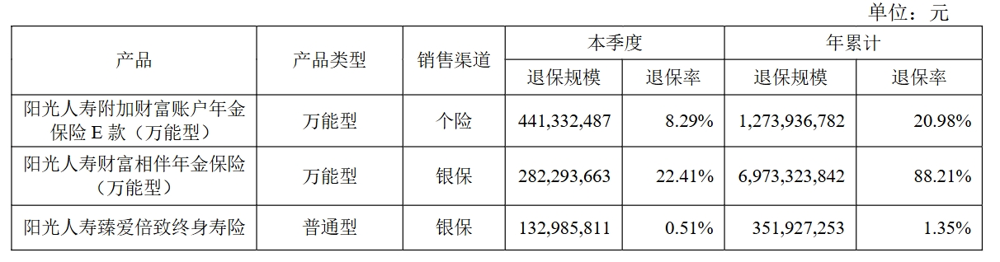</center>

2023年第4季度偿付能力报告摘要-退保金额前三

<center>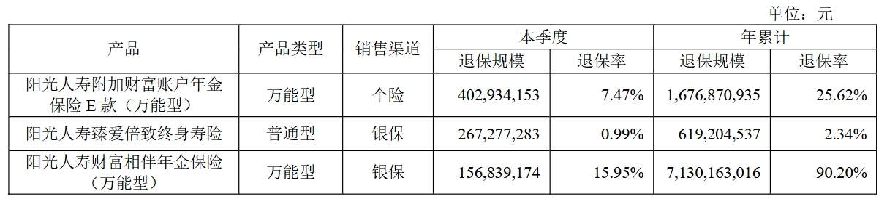</center>

2023年第3季度偿付能力报告摘要-退保金额前三

<center>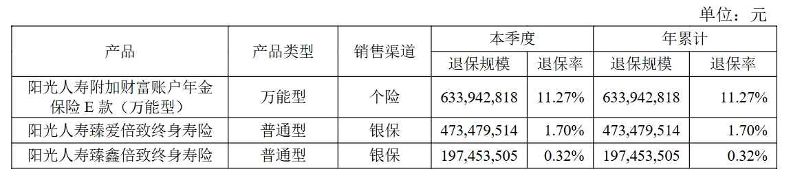</center>

2023年第2季度偿付能力报告摘要-退保金额前三

<center>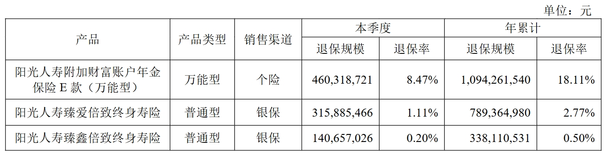</center>

2023年第1季度偿付能力报告摘要-退保金额前三

<center>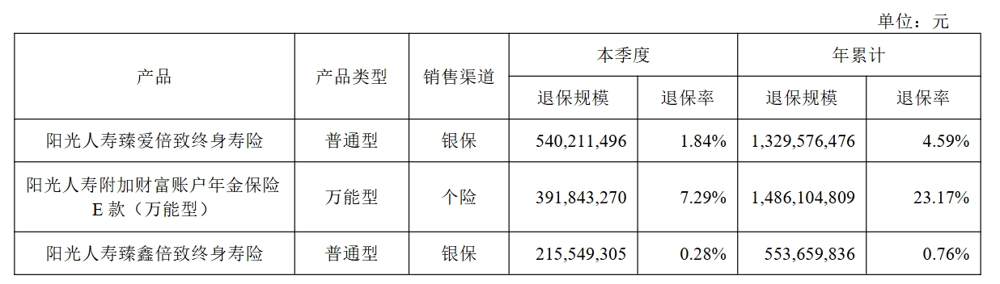</center>


**4 本文算例及资源**

https://github.com/excellentfund/articles